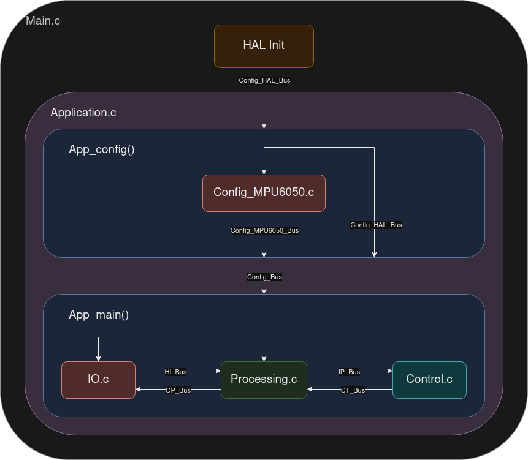
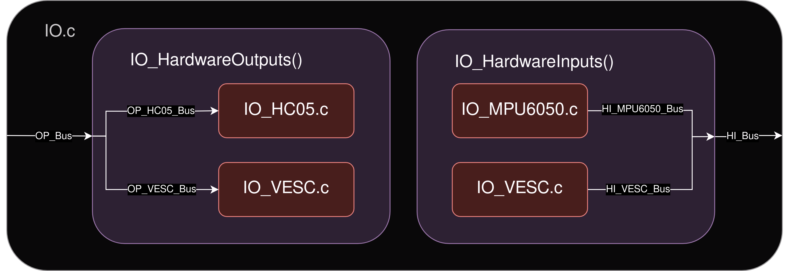
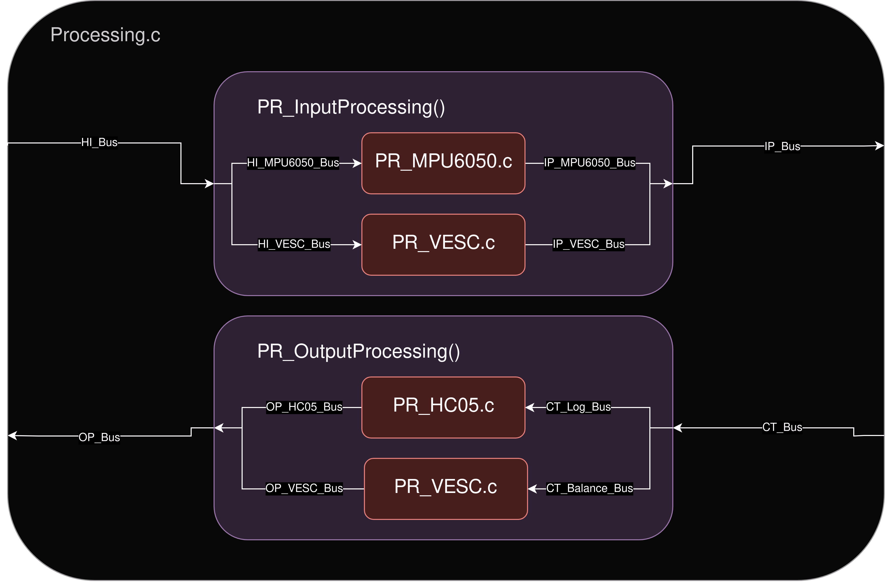
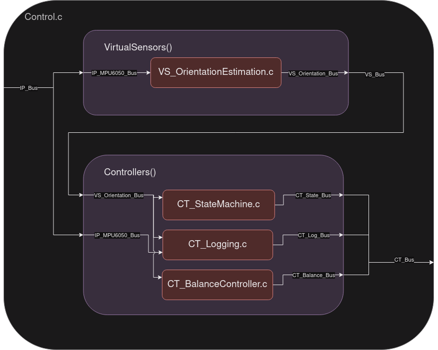

# STM32 Reaction Wheel Development

This repo is used to store all development information for STM32 reaction wheel project.

## Software Architecture
This project has been split up into several source files in an effort to abstract the core control logic from the specific hardware. The overall software archecture is described in the block diagrams below.

### Application Block Diagram

### IO Block Diagram

### Processing Block Diagram

### Control Block Diagram
